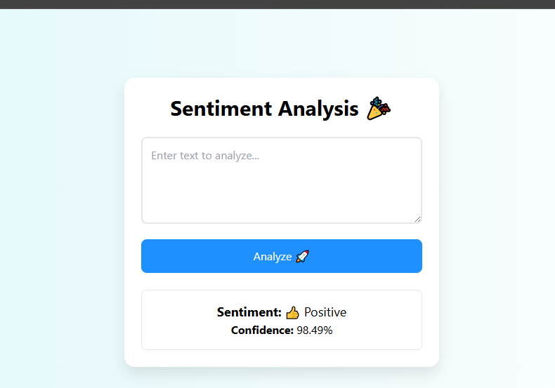

# Sentiment Analysis Web App

## Overview
This project is a machine learning-based web application that performs sentiment analysis on user-input text. It uses a pre-trained DistilBERT model from Hugging Face to classify text as Positive or Negative, and is deployed as a Flask web app on Render. The app features an enhanced UI with Tailwind CSS styling and emojis for a more engaging user experience.

## Features
- **Sentiment Prediction**: Classifies text as Positive or Negative with confidence scores.
- **Enhanced Web Interface**: A visually appealing UI built with Flask and Tailwind CSS, featuring a gradient background, teal accents, and emojis (👍 for Positive, 👎 for Negative) in the results.
- **Deployment**: Hosted live on Render for public access.

## Tech Stack
- **Machine Learning**: Python, Hugging Face Transformers, PyTorch
- **Web Development**: Flask, HTML, Tailwind CSS
- **Deployment**: Render

## Screenshots
  
*Updated UI with gradient background, teal styling, and emoji-enhanced results.*

*(Add a screenshot of your live app by uploading an image to a `screenshots` folder in your repository and updating the path above.)*

## Setup Instructions
1. **Clone the Repository**:
   ```bash
   git clone <your-repo-url>
   cd sentiment-analysis-app
   ```
2. **Install Dependencies**:
   ```bash
   pip install -r requirements.txt
   ```
3. **Run Locally**:
   ```bash
   python sentiment_analysis_app.py
   ```
   Access at `http://localhost:5000`.

## Deployment
1. **Render Setup**:
   - Create a free account on Render (https://render.com).
   - Create a new Web Service and connect your GitHub repository.
   - Set the runtime to Python and use the following build command:
     ```bash
     pip install -r requirements.txt
     ```
   - Set the start command:
     ```bash
     gunicorn --bind 0.0.0.0:$PORT sentiment_analysis_app:app
     ```
2. **Push Requirements**:
   Ensure `requirements.txt` is in the repository.
3. Deploy and access the live URL provided by Render.

## Highlight
- Developed and deployed a sentiment analysis web app using DistilBERT and Flask.
- Designed an engaging UI with Tailwind CSS, featuring gradient styling and emoji-enhanced results.
- Demonstrated proficiency in NLP, web development, and cloud deployment.
- Live demo: [Insert Render URL after deployment]

## Future Improvements
- Add support for multi-class sentiment (e.g., Neutral).
- Enhance UI with real-time predictions using JavaScript.
- Optimize model for faster inference.