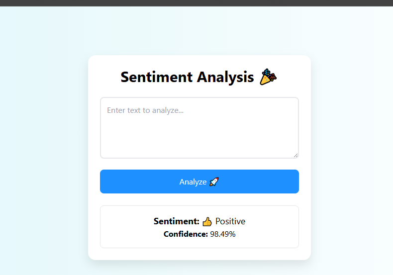

# Sentiment Analysis Web App

## Overview
A machine learning-based web application that performs sentiment analysis on user-input text. Uses a pre-trained DistilBERT model (SST-2) from Hugging Face, running via **ONNX Runtime** — no PyTorch required — and deployed as a Flask web app on Render.

## Features
- **Sentiment Prediction** — Classifies text as Positive or Negative with confidence scores and a visual confidence bar.
- **Lightweight Inference** — Runs on ONNX Runtime instead of PyTorch, reducing the dependency footprint from ~700 MB to ~10 MB.
- **REST API** — JSON endpoint at `/api/predict` for programmatic use.
- **Clean Dark UI** — Custom-styled interface with DM Serif Display typography, animated results, and emoji indicators.
- **Deployment Ready** — Configured for Render with `gunicorn`.

## Tech Stack
- **ML / Inference**: Hugging Face Transformers, Optimum, ONNX Runtime
- **Web**: Flask, Jinja2, HTML/CSS
- **Deployment**: Render (gunicorn)

## Screenshots


## Project Structure
```
sentiment-analysis-app/
├── sentiment_analysis_app.py   # Flask app + inference logic
├── requirements.txt
└── templates/
    └── index.html              # Frontend UI
```

## Setup

**1. Clone the repository**
```bash
git clone <your-repo-url>
cd sentiment-analysis-app
```

**2. Install dependencies**
```bash
pip install -r requirements.txt
```

**3. Run locally**
```bash
python sentiment_analysis_app.py
```
Visit `http://localhost:5000`. The ONNX model (~250 MB) downloads automatically on first run.

## API Usage
```bash
curl -X POST http://localhost:5000/api/predict \
  -H "Content-Type: application/json" \
  -d '{"text": "This is absolutely amazing!"}'
```
```json
{
  "sentiment": "Positive",
  "confidence": 0.9987,
  "emoji": "😊",
  "text": "This is absolutely amazing!"
}
```

## Deployment on Render
1. Create a free account at [render.com](https://render.com) and connect your GitHub repo.
2. Set runtime to **Python**.
3. Build command:
   ```bash
   pip install -r requirements.txt
   ```
4. Start command:
   ```bash
   gunicorn --bind 0.0.0.0:$PORT sentiment_analysis_app:app
   ```
5. Deploy — Render provides a live URL automatically.

## Why ONNX Runtime instead of PyTorch?
| | PyTorch | ONNX Runtime |
|---|---|---|
| Install size | ~700 MB | ~10 MB |
| CPU inference speed | Baseline | ~1.5–2× faster |
| Required for this app | No | Yes |

## Future Improvements
- Add Neutral class support for nuanced sentiment.
- Real-time predictions via JavaScript (no page reload).
- Batch text analysis from file upload.
- Confidence threshold warnings for borderline predictions.