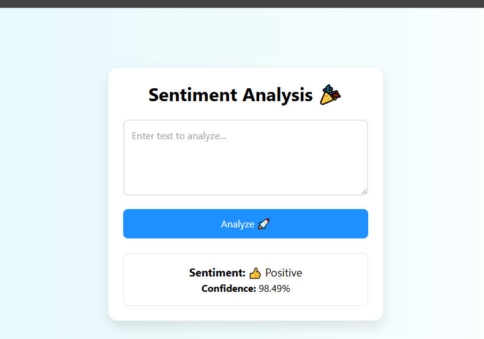

# Sentiment Lab

Sentiment Lab is a portfolio-ready NLP dashboard that turns raw text into a useful signal. It combines a production-minded inference API with a small analytics workspace, making the project demonstrate more than a model call: batching, data profiling, confidence communication, deployment health checks, and responsive product UI.



## What this showcases

- **ML engineering:** DistilBERT fine-tuned on SST-2, exported for ONNX Runtime, NumPy-native inference, stable softmax probabilities, and configurable model loading.
- **Data analysis:** batch scoring for up to 100 rows, positive/negative distribution, average confidence, latency, text-length metadata, and row-level predictions.
- **Product thinking:** confidence bands, model limitations, clear empty/loading/error states, keyboard shortcut, sample data, and a responsive dashboard layout.
- **Deployment readiness:** `/api/health`, environment-based `PORT` and `SENTIMENT_MODEL`, bounded request sizes, JSON validation, and Gunicorn compatibility.

## Stack

| Layer | Tools |
| --- | --- |
| Model | Hugging Face Transformers · DistilBERT · SST-2 |
| Inference | Optimum · ONNX Runtime · NumPy |
| Application | Flask · Jinja2 · REST JSON endpoints |
| Interface | Responsive HTML/CSS/JavaScript · no frontend build step |
| Deployment | Gunicorn · Render-friendly start command |

## Run locally

```bash
git clone <your-repo-url>
cd sentiment-analysis-app
pip install -r requirements.txt
python sentiment_analysis_app.py
```

Open `http://localhost:5000`. The model and tokenizer download from Hugging Face on the first launch. The app runs on CPU and does not require PyTorch.

## API

Single prediction:

```bash
curl -X POST http://localhost:5000/api/predict \
  -H "Content-Type: application/json" \
  -d '{"text":"The onboarding was smooth and delightful."}'
```

Batch analytics:

```bash
curl -X POST http://localhost:5000/api/batch \
  -H "Content-Type: application/json" \
  -d '{"texts":["Fast delivery and great quality.","The support experience was frustrating."]}'
```

Useful operational endpoint:

```bash
curl http://localhost:5000/api/health
```

The batch response contains both `results` and a `summary` object with counts, sentiment share, average confidence, confidence bands, and inference latency.

## Deployment on Render

- **Build command:** `pip install -r requirements.txt`
- **Start command:** `gunicorn --bind 0.0.0.0:$PORT sentiment_analysis_app:app`

The app reads `PORT` automatically and exposes `/api/health` for service checks.

## Important model limitation

The underlying classifier is trained for English movie-review sentiment. Confidence is a model score, not a probability guarantee. Treat low-confidence results as review candidates, especially for sarcasm, mixed sentiment, domain-specific language, or text outside the model's training distribution.

## Project structure

```text
sentiment-analysis-app/
├── sentiment_analysis_app.py   # Flask app, inference, batch analytics, API
├── requirements.txt
├── README.md
└── templates/
    └── index.html              # Responsive dashboard UI
```
